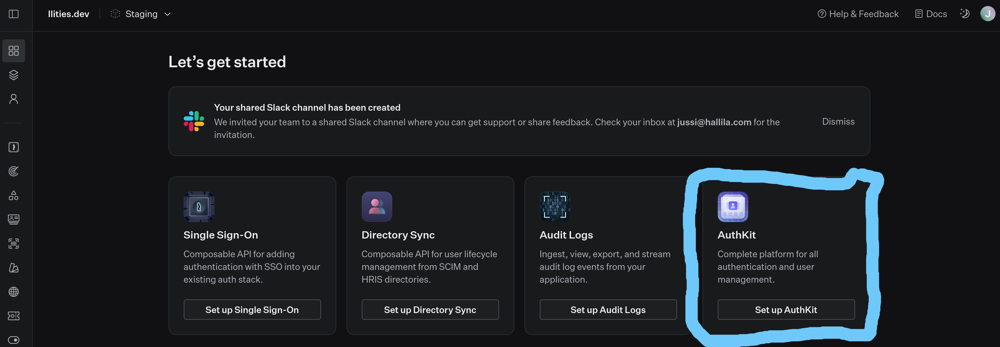
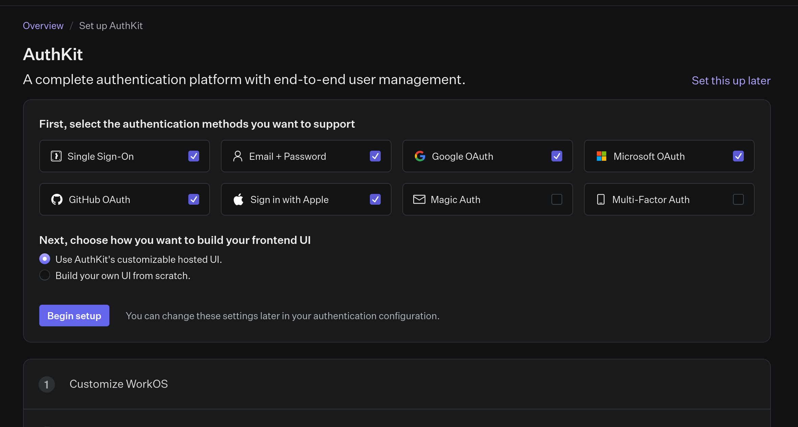
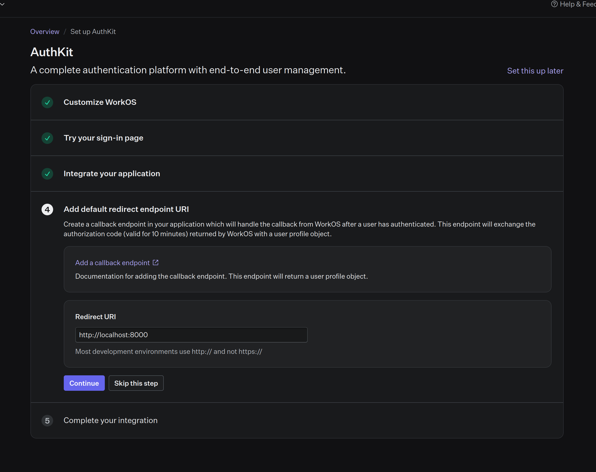
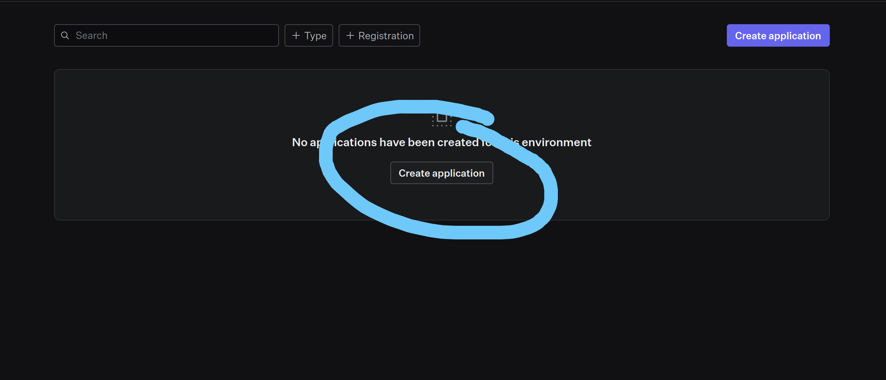
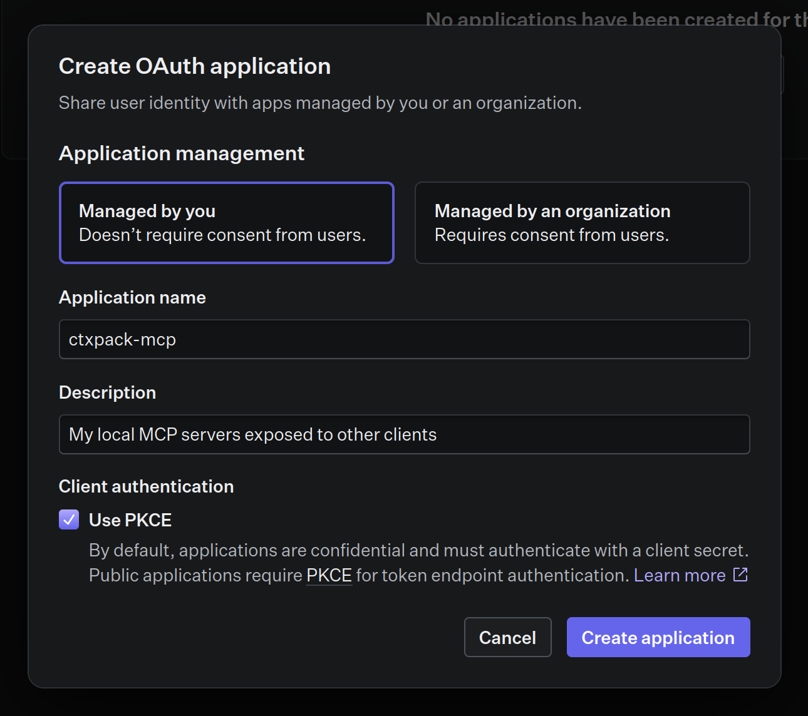
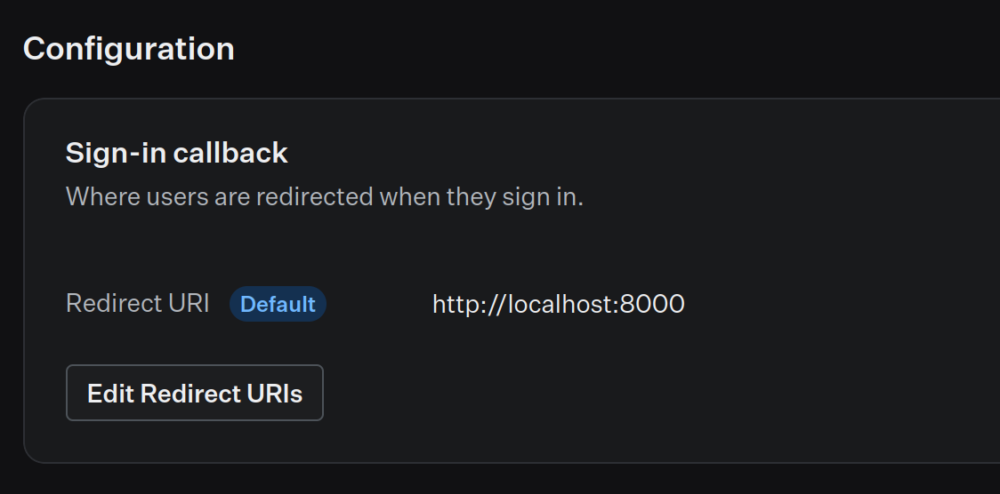
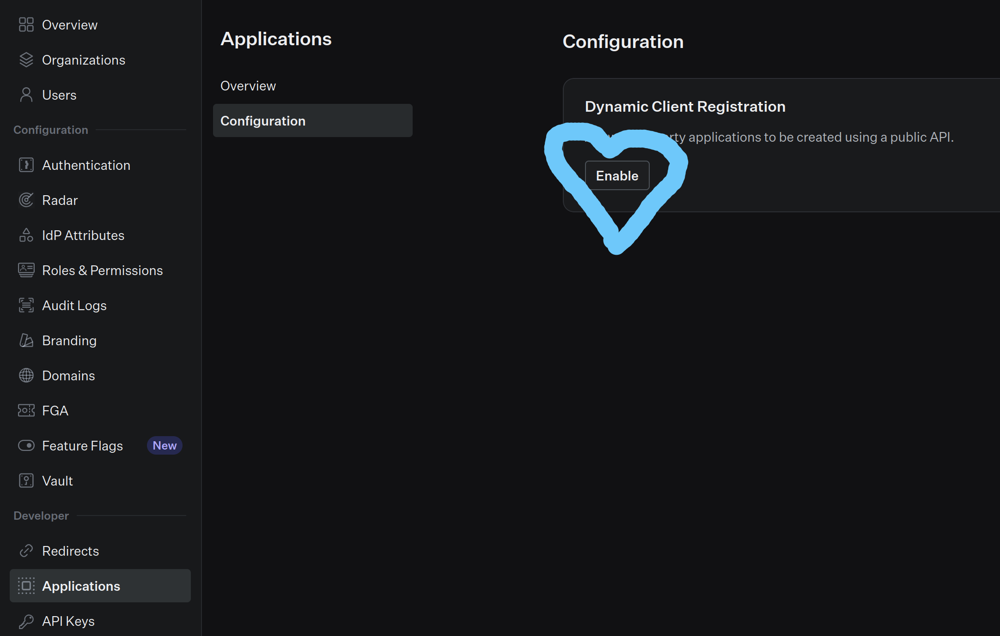
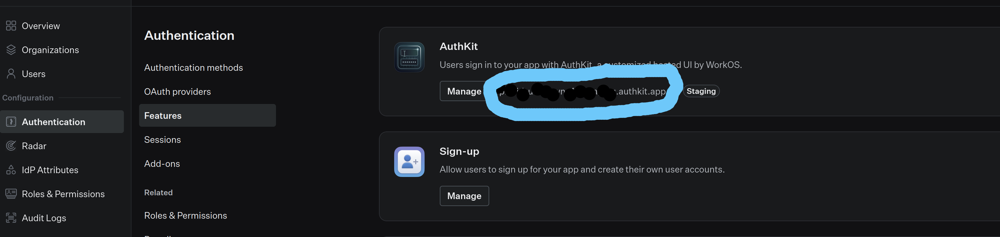
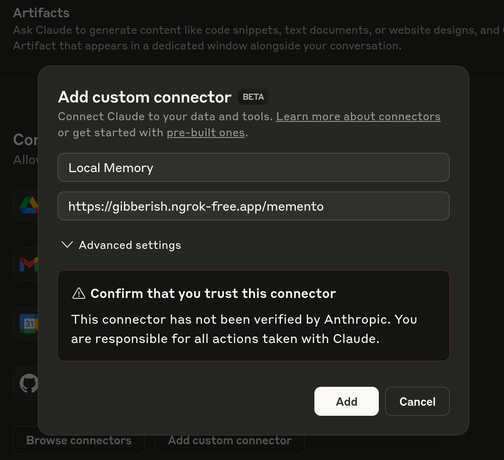
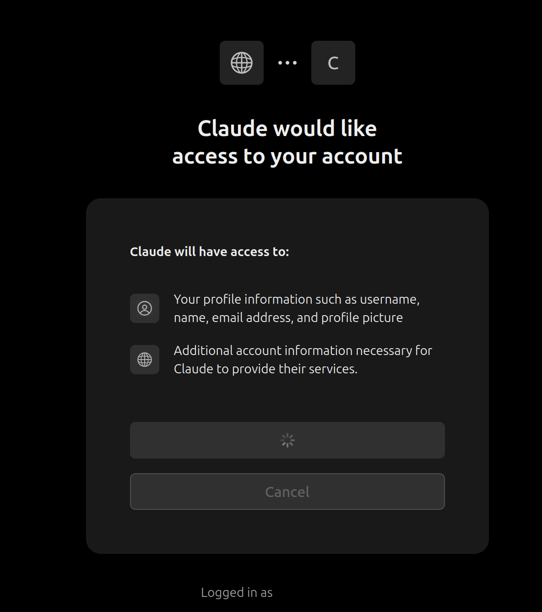

# Local Ctx

An MCP server helper allows users to expose standard STDIO servers as Streamable HTTP to external clients. Supports authentication via OAuth.
This allows you to expose your locally running MCP servers securely to cloud based clients like Claude.ai or ChatGPT, making it possible, for example, to control your computer with your phone (not really since their apps don't support MCP). Or expose MCP servers on your computer to your friends or colleagues, acquaintances is probably a bridge too far. 

## Features

- Connects a child process using stdio to a Streamable HTTP endpoint
- Supports OAuth authentication via JWT tokens
- Multiple configuration methods (JSON files, CLI arguments, environment variables)

## Usage

### Using npx (Recommended)

```bash
# Basic usage with command-line arguments
npx @ilities/local-ctx --commands '[{"name":"memory","command":"npx -y @modelcontextprotocol/server-memory"}]' --port 8000

# Using a configuration file
npx @ilities/local-ctx --config ./my-config.json

# Using environment variables with custom port
PORT=9000 COMMANDS='[{"name":"memory","command":"npx -y @modelcontextprotocol/server-memory"}]' npx @ilities/local-ctx
```

### Dev mode/Using node 

```bash
git clone https://github.com/Ilities/local-ctx.git

# Install locally
npm install

# Build the project
npm run build

# Basic usage with command-line arguments
node dist/index.js --commands '[{"name":"memory","command":"npx -y @modelcontextprotocol/server-memory"}]' --port 8000

# Using a configuration file
node dist/index.js --config ./my-config.json

# Using environment variables with custom port
PORT=9000 COMMANDS='[{"name":"memory","command":"npx -y @modelcontextprotocol/server-memory"}]' node dist/index.js
```

## Configuration Methods

Local Ctx supports running multiple local MCP servers simultaneously. They are all spun up as standard STDIO servers based on the commands provided.

They are exposed as Streamable HTTP endpoints **which is generated based on the name given for the command in the configuration**.

For example command:
```json
{
  "name": "memento",
  "command": "npx -y @modelcontextprotocol/server-memory"
}
```

Will expose streamable HTTP `server-memory` MCP server on address `http://localhost:8000/memento`.


Configuration is loaded in the following order of precedence (highest to lowest):

1. Command-line arguments
2. Environment variables
3. JSON configuration file

### Command Line Options

- `--config, -c`: Path to JSON configuration file
- `--port, -p`: Port number for the server (default: 8000)
- `--commands`: JSON string of commands configuration
- `--authorizationServerUrl`: URL for the OAuth authorization server

### Environment Variables

- `PORT`: Port number for the server
- `COMMANDS`: JSON string array of command configurations

### Configuration File Format

Specify a path with the `--config` option to a `config.json` file:

`npx @ilities/local-ctx --config config.json`

```json
{
  "commands": [
    {
      "name": "memory",
      "command": "npx -y @modelcontextprotocol/server-memory"
    }
  ],
  "port": 8000,
  "oauth": {
    "authorizationServerUrl": "https://your-auth-server.example.com",
    "jwksPath": "/optional-jwks-path"
  }
}
```

### Command Configuration

Each command requires the following properties:

- `name`: Unique identifier for the command (used as the endpoint path)
- `command`: The shell command to execute to spin up an MCP server. The tools to run the command needs to be present on the system (npx, uv, python etc. depending on the server)

### OAuth Configuration

OAuth can be configured to secure your endpoints:

- `authorizationServerUrl`: URL of the OAuth authorization server
- `jwksPath`: Optional path to the JWKS endpoint (defaults to standard path which is `/oauth2/jwks`)

When OAuth is configured, the server will automatically:
- Expose OAuth discovery endpoints at `/.well-known/oauth-protected-resource` and `/.well-known/oauth-authorization-server`
- Require valid JWT bearer tokens for all command endpoints


## Auth Setup

Currently the utility has been tested with WorkOS. Other implementations are welcome.

### WorkOS

WorkOS is one the IDPs that support OAuth 2.1 (though, like many of them, still not providing good enough CORS header support for all clients). The setup to secure your local MCP servers that are exposed externally is fairly straight forward. The steps are:
1. Sign up to WorkOS
2. Click on the 'Set Up AuthKit' button on the main page. <details><summary>See Image</summary></details>
3. Step through the wizard <details><summary>See Image</summary></details>
4. On Step 4, set `http://localhost:8000` (or your port config) as the callback URL <details><summary>See Image</summary></details>
5. *(Optional)* Navigate to 'Applications' on the left menu. Click 'Create application' <details><summary>See Image</summary></details>
6. *(Optional)* Select OAuth Application on the dialog
7. *(Optional)* Add name and description to yout app. Enable PKCE. Click 'Create Application' <details><summary>See Image</summary></details>
8. *(Optional)* Add `http://localhost:8000` as the redirect URL for the application <details><summary>See Image</summary></details>
9. Navigate back to Applications on the left menu, click 'Configuration' on the second level menu and **Enable _Dynamic Client Registration_** <details><summary>See Image</summary></details>
10. Disable/Enable your wanted OAuth providers. You need to create OAuth client/secret pairs for each is you want to enable them.
    * The easiest way to get started is to disable everything and rely on WorkOS Username/Password auth. To do that, create a user in WorkOS
11.  Navigate to Authentication -> Features -> Copy the **AuthKit URL** .<details><summary>See Image</summary></details>
12. Add the copied URL to you `config.json` as the `oauth.authorizationServerUrl`. Start with `https://...`


## Exposing externally

You can expose the created MCP server now externally using tunneling tools. It is recommended to set up auth (see above ^^) before doing that, otherwise it is publicly available.

### ngrok

Ngrok provides tunneling services that you can use to expose your server to the internet

1. Log in/Sign up to [ngrok](https://ngrok.com/)
2. Install the ngrok binary as stated in their documentation `https://dashboard.ngrok.com/get-started/setup/linux`
3. Run the tunnel `ngrok http http://localhost:8000`
4. Register the server to your LLM Client with the URL `ngrok` gave you + the path of the tool.

### Pinggy

Pinggy is a tunneling service that provides simple localhost tunnels to bring your local projects online without a need to install a client.


1. Navigate to https://pinggy.io/
2. (Optional) Sign up/login
3. Run the command to establish a tunnel connection `ssh -p 443 -R0:localhost:8000 qr@free.pinggy.io`
4. Register the server to your LLM Client with the URL `Pinggy` gave you + the path of the tool.


## Configuring with AI Clients
Since the whole purpose of this exercise was to expose our local MCP server to the internet securely, let's connect it to an application.

### Claude AI (web)

1. Click the `tuning` icon on the bottom of your chat box -> Manage connectors
2. Click **Add Custom Connector**
3. Give a name to your "connector" and add the URL <details><summary>See Image</summary></details>
  * Each server is exposed on their own endpoint so the URL to use would look something like `https://gibberish.ngrok-free.app/memento` (if `memento` would be the `name` value of your command).
4. Click "Connect" and go through the login loop towards WorkOS <details><summary>See Image</summary></details>
5. You should see a green notification on the top right telling you that your connector is connected.


## Sponsor

This project is sponsored by [Ctxpack](https://ctxpack.com) - (em-dash) a context management platform for AI tools and workflows.

If you're managing multiple MCP servers or AI tools across your organization, Ctxpack helps you package and share configurations as reusable "context packs" that work with Claude, ChatGPT, and other AI platforms.

{rocket or some other random emoji that an AI uses}

[Learn more →](https://ctxpack.com)

---

## License

[MIT License](./LICENSE)