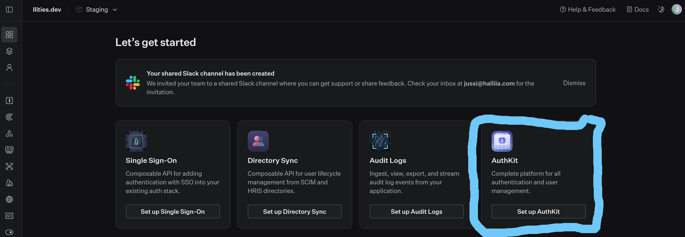
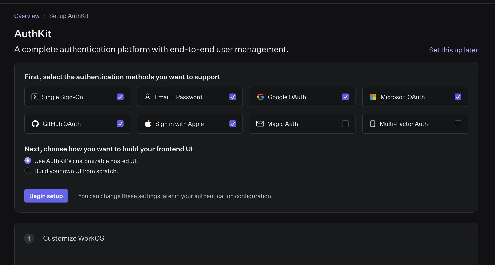
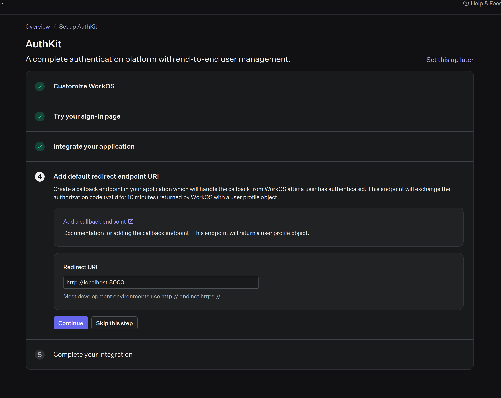
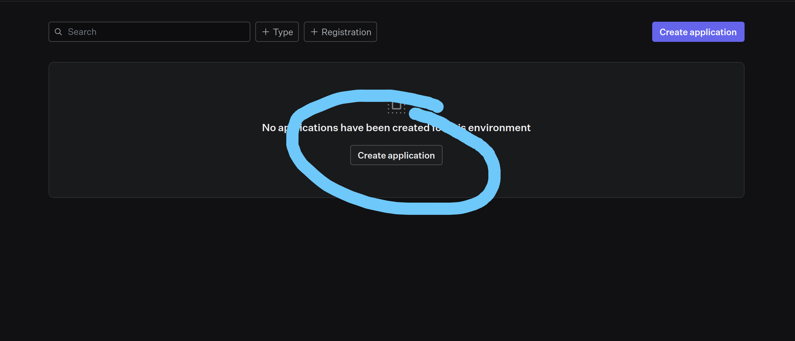
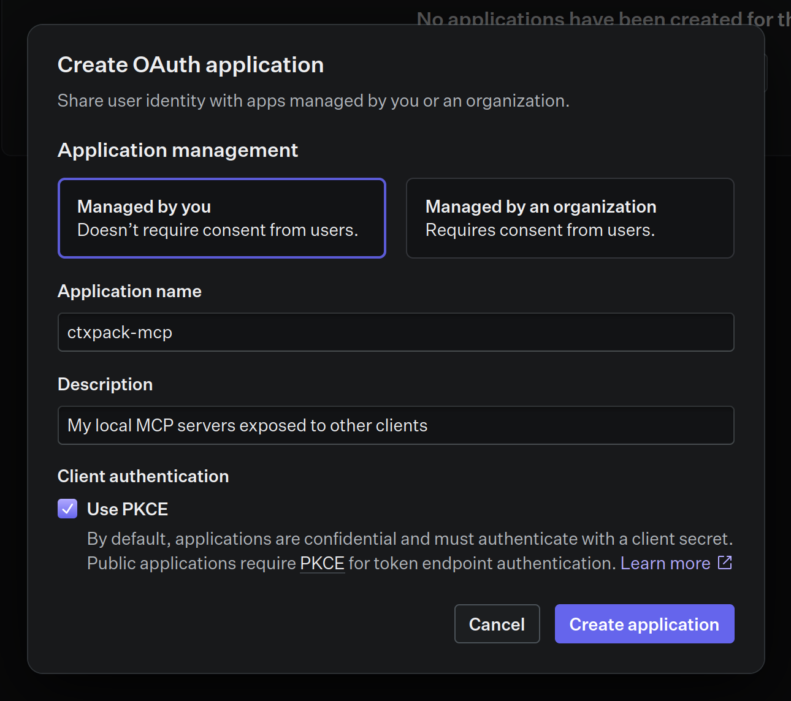
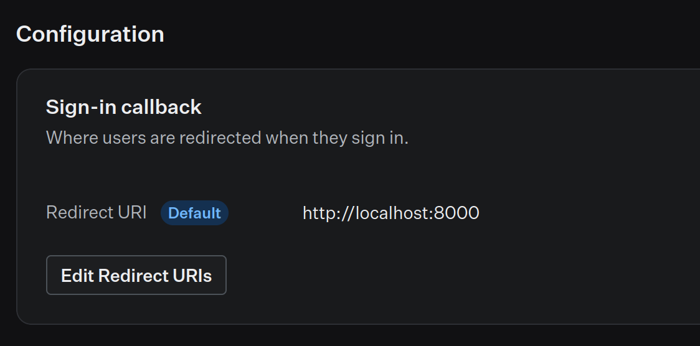
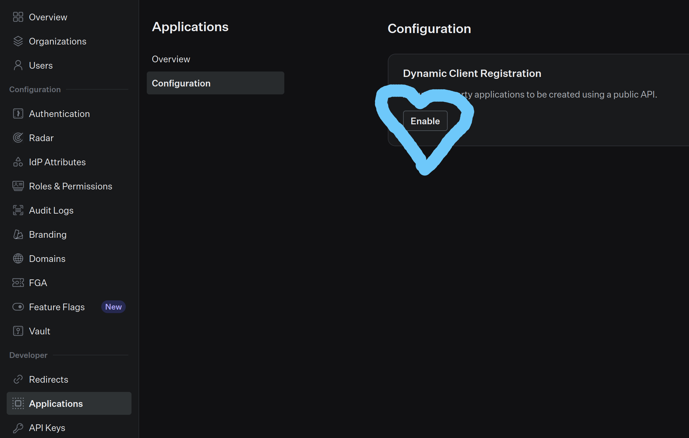
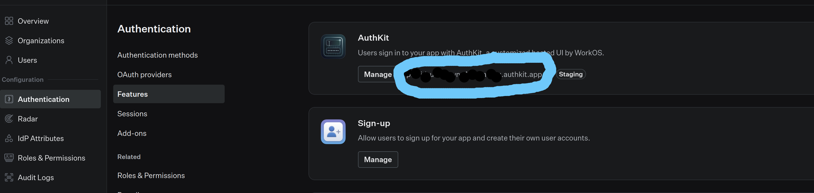
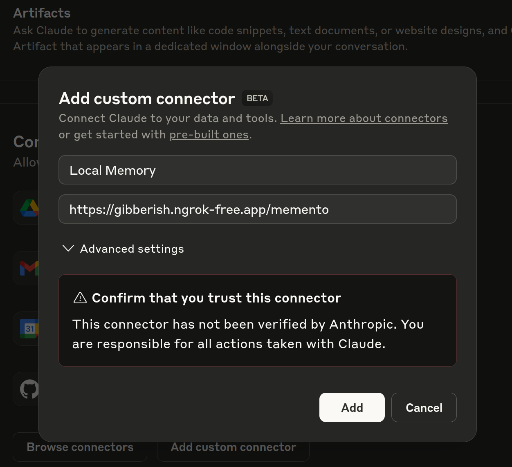
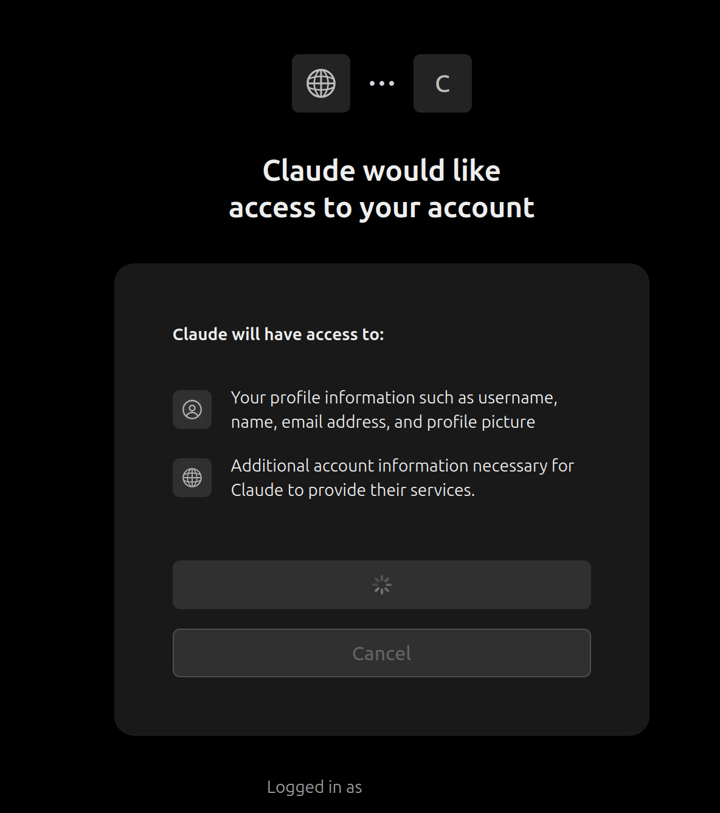

# Local Ctx

An MCP server helper allows users to expose standard STDIO servers as Streamable HTTP to external clients. Supports authentication via OAuth.
This allows you to expose your locally running MCP servers securely to cloud based clients like Claude.ai or ChatGPT, making it possible, for example, to control your computer with your phone (not really since their apps don't support MCP). Or expose MCP servers on your computer to your friends or colleagues, acquaintances is probably a bridge too far.

## Features

- Connects a child process using stdio to a Streamable HTTP endpoint
- Supports OAuth authentication via JWT tokens
- Multiple configuration methods (JSON files, CLI arguments, environment variables)

## Usage

### Using npx (Recommended)

```bash
# Basic usage with command-line arguments
npx @ilities/local-ctx --commands '[{"name":"memory","command":"npx -y @modelcontextprotocol/server-memory"}]' --port 8000

# Using a configuration file
npx @ilities/local-ctx --config ./my-config.json

# Using environment variables with custom port
PORT=9000 COMMANDS='[{"name":"memory","command":"npx -y @modelcontextprotocol/server-memory"}]' npx @ilities/local-ctx
```

### Dev mode/Using node

```bash
git clone https://github.com/Ilities/local-ctx.git

# Install locally
npm install

# Build the project
npm run build

# Basic usage with command-line arguments
node dist/index.js --commands '[{"name":"memory","command":"npx -y @modelcontextprotocol/server-memory"}]' --port 8000

# Using a configuration file
node dist/index.js --config ./my-config.json

# Using environment variables with custom port
PORT=9000 COMMANDS='[{"name":"memory","command":"npx -y @modelcontextprotocol/server-memory"}]' node dist/index.js
```

## Configuration Methods

Local Ctx supports running multiple local MCP servers simultaneously. They are all spun up as standard STDIO servers based on the commands provided.

They are exposed as Streamable HTTP endpoints **which is generated based on the name given for the command in the configuration**.

For example command:

```json
{
  "name": "memento",
  "command": "npx -y @modelcontextprotocol/server-memory"
}
```

Will expose streamable HTTP `server-memory` MCP server on address `http://localhost:8000/memento`.

Configuration is loaded in the following order of precedence (highest to lowest):

1. Command-line arguments
2. Environment variables
3. JSON configuration file

### Command Line Options

- `--config, -c`: Path to JSON configuration file
- `--port, -p`: Port number for the server (default: 8000)
- `--commands`: JSON string of commands configuration
- `--authorizationServerUrl`: URL for the OAuth authorization server

### Environment Variables

- `PORT`: Port number for the server
- `COMMANDS`: JSON string array of command configurations

### Configuration File Format

Specify a path with the `--config` option to a `config.json` file:

`npx @ilities/local-ctx --config config.json`

```json
{
  "commands": [
    {
      "name": "memory",
      "command": "npx -y @modelcontextprotocol/server-memory"
    }
  ],
  "port": 8000,
  "oauth": {
    "authorizationServerUrl": "https://your-auth-server.example.com",
    "jwksPath": "/optional-jwks-path"
  }
}
```

### Command Configuration

Each command requires the following properties:

- `name`: Unique identifier for the command (used as the endpoint path)
- `command`: The shell command to execute to spin up an MCP server. The tools to run the command needs to be present on the system (npx, uv, python etc. depending on the server)

### OAuth Configuration

OAuth can be configured to secure your endpoints:

- `authorizationServerUrl`: URL of the OAuth authorization server
- `jwksPath`: Optional path to the JWKS endpoint (defaults to standard path which is `/oauth2/jwks`)

When OAuth is configured, the server will automatically:

- Expose OAuth discovery endpoints at `/.well-known/oauth-protected-resource` and `/.well-known/oauth-authorization-server`
- Require valid JWT bearer tokens for all command endpoints

## Auth Setup

Currently the utility has been tested with WorkOS. Other implementations are welcome.

### WorkOS

WorkOS is one the IDPs that support OAuth 2.1 (though, like many of them, still not providing good enough CORS header support for all clients). The setup to secure your local MCP servers that are exposed externally is fairly straight forward. The steps are:

1. Sign up to WorkOS
2. Click on the 'Set Up AuthKit' button on the main page. <details><summary>See Image</summary></details>
3. Step through the wizard <details><summary>See Image</summary></details>
4. On Step 4, set `http://localhost:8000` (or your port config) as the callback URL <details><summary>See Image</summary></details>
5. _(Optional)_ Navigate to 'Applications' on the left menu. Click 'Create application' <details><summary>See Image</summary></details>
6. _(Optional)_ Select OAuth Application on the dialog
7. _(Optional)_ Add name and description to yout app. Enable PKCE. Click 'Create Application' <details><summary>See Image</summary></details>
8. _(Optional)_ Add `http://localhost:8000` as the redirect URL for the application <details><summary>See Image</summary></details>
9. Navigate back to Applications on the left menu, click 'Configuration' on the second level menu and **Enable _Dynamic Client Registration_** <details><summary>See Image</summary></details>
10. Disable/Enable your wanted OAuth providers. You need to create OAuth client/secret pairs for each is you want to enable them.
    - The easiest way to get started is to disable everything and rely on WorkOS Username/Password auth. To do that, create a user in WorkOS
11. Navigate to Authentication -> Features -> Copy the **AuthKit URL** .<details><summary>See Image</summary></details>
12. Add the copied URL to you `config.json` as the `oauth.authorizationServerUrl`. Start with `https://...`

## Exposing externally

You can expose the created MCP server now externally using tunneling tools. It is recommended to set up auth (see above ^^) before doing that, otherwise it is publicly available.

### ngrok

Ngrok provides tunneling services that you can use to expose your server to the internet

1. Log in/Sign up to [ngrok](https://ngrok.com/)
2. Install the ngrok binary as stated in their documentation `https://dashboard.ngrok.com/get-started/setup/linux`
3. Run the tunnel `ngrok http http://localhost:8000`
4. Register the server to your LLM Client with the URL `ngrok` gave you + the path of the tool.

### Pinggy

Pinggy is a tunneling service that provides simple localhost tunnels to bring your local projects online without a need to install a client.

1. Navigate to https://pinggy.io/
2. (Optional) Sign up/login
3. Run the command to establish a tunnel connection `ssh -p 443 -R0:localhost:8000 qr@free.pinggy.io`
4. Register the server to your LLM Client with the URL `Pinggy` gave you + the path of the tool.

## Configuring with AI Clients

Since the whole purpose of this exercise was to expose our local MCP server to the internet securely, let's connect it to an application.

### Claude AI (web)

1. Click the `tuning` icon on the bottom of your chat box -> Manage connectors
2. Click **Add Custom Connector**
3. Give a name to your "connector" and add the URL <details><summary>See Image</summary></details>

- Each server is exposed on their own endpoint so the URL to use would look something like `https://gibberish.ngrok-free.app/memento` (if `memento` would be the `name` value of your command).

4. Click "Connect" and go through the login loop towards WorkOS <details><summary>See Image</summary></details>
5. You should see a green notification on the top right telling you that your connector is connected.

## Sponsor

This project is sponsored by [Ctxpack](https://ctxpack.com) - (em-dash) a context management platform for AI tools and workflows.

If you're managing multiple MCP servers or AI tools across your organization, Ctxpack helps you package and share configurations as reusable "context packs" that work with Claude, ChatGPT, and other AI platforms.

{rocket or some other random emoji that an AI uses}

[Learn more →](https://ctxpack.com)

---

## Troubleshooting

### Port Already in Use

If you see `Error: listen EADDRINUSE :::8000`, another process is using the port.

**Solutions:**

- Find and stop the conflicting process: `lsof -i :8000` (macOS/Linux) or `netstat -ano | findstr :8000` (Windows)
- Use a different port: `npx @ilities/local-ctx --port 9000`

### Command Not Found Errors

If you see `Error: spawn XXXX ENOENT`, the required command is not installed.

**Solutions:**

- Install the required tool (npx, python, uv, etc.)
- Use the full path to the executable
- For npx errors, ensure Node.js is installed: `node --version`

### OAuth Token Validation Failures

If clients receive 401 Unauthorized errors:

- Verify the `authorizationServerUrl` is correct and accessible
- Ensure the OAuth server is running and reachable from both your machine and the tunneling service
- Check that the client is sending a valid, non-expired JWT token
- For WorkOS, verify your AuthKit URL is current in your configuration

### Connection Timeouts

If clients report connection timeouts:

- Verify the local server is running: check for "Listening on port" log message
- Ensure the tunneling service (ngrok/Pinggy) is still active
- Check firewall rules allow outbound connections to the tunneling service
- Verify the endpoint URL includes the correct path (e.g., `/memento` not just the base URL)

## Advanced Usage

### Multiple MCP Servers

Run multiple MCP servers simultaneously by providing multiple commands:

```json
{
  "commands": [
    {
      "name": "memory",
      "command": "npx -y @modelcontextprotocol/server-memory"
    },
    {
      "name": "filesystem",
      "command": "npx -y @modelcontextprotocol/server-filesystem /path/to/directory"
    },
    {
      "name": "github",
      "command": "npx -y @modelcontextprotocol/server-github"
    }
  ],
  "port": 8000
}
```

Each server becomes accessible at its own endpoint:

- `http://localhost:8000/memory`
- `http://localhost:8000/filesystem`
- `http://localhost:8000/github`

### Multi-Environment Configurations

Use separate config files for different environments:

**config.dev.json:**

```json
{
  "commands": [
    {
      "name": "memory",
      "command": "npx -y @modelcontextprotocol/server-memory"
    }
  ],
  "port": 8000
}
```

**config.prod.json:**

```json
{
  "commands": [
    {
      "name": "memory",
      "command": "npx -y @modelcontextprotocol/server-memory"
    }
  ],
  "port": 8000,
  "oauth": {
    "authorizationServerUrl": "https://your-workos-instance.workos.com"
  }
}
```

Switch between environments:

```bash
npx @ilities/local-ctx --config config.dev.json  # Development
npx @ilities/local-ctx --config config.prod.json # Production
```

### Programmatic Usage

While designed as a CLI tool, local-ctx can be imported as a module:

```typescript
import { LocalContextServer, CommandConfig } from '@ilities/local-ctx';

const commands: CommandConfig[] = [
  {
    name: 'memory',
    command: 'npx -y @modelcontextprotocol/server-memory',
  },
];

const config = {
  commands,
  port: 8000,
};

// Use the server class directly
// Note: This requires the dist build to be available
```

## Environment Variable Reference

| Variable   | Description                                 | Default |
| ---------- | ------------------------------------------- | ------- |
| `PORT`     | Port number for the HTTP server             | `8000`  |
| `COMMANDS` | JSON string array of command configurations | (none)  |

## Security Considerations

### Risks of Unauthenticated Exposure

**Never expose local-ctx without OAuth authentication to the public internet.** Without authentication, anyone can:

- Access files on your computer (if using a filesystem MCP server)
- Execute commands on your behalf
- Access sensitive data through your MCP servers

### OAuth Configuration Recommendations

1. **Always enable OAuth for production deployments**
2. **Use a reputable OAuth provider** (WorkOS has been tested)
3. **Keep your OAuth credentials secure** - never commit them to version control
4. **Use environment-specific configurations** for development vs production

### Tunneling Service Security

When using tunneling services:

- Prefer services that support authentication
- Regularly regenerate tunnel URLs when not in use
- Consider using IP allowlisting if your OAuth provider supports it
- Monitor access logs for unauthorized access attempts

### General Best Practices

- Limit the MCP servers you expose externally
- Review the commands your MCP servers can execute
- Keep your OAuth tokens short-lived
- Regularly update your dependencies

## Contributing

Contributions are welcome! Please follow these guidelines:

### Development Setup

```bash
# Clone the repository
git clone https://github.com/Ilities/local-ctx.git
cd local-ctx

# Install dependencies
npm install

# Build the project
npm run build

# Run in development mode
npm run start
```

### Code Style

This project uses Prettier for formatting:

```bash
# Check formatting
npm run format:check

# Format code
npm run format
```

### Pull Request Process

1. Fork the repository
2. Create a feature branch: `git checkout -b feature/my-feature`
3. Make your changes and ensure formatting is correct
4. Submit a pull request with a clear description of the changes

### Reporting Issues

When reporting issues, please include:

- The version of local-ctx (check with `npm list @ilities/local-ctx`)
- Your operating system and Node.js version
- The configuration you're using (remove sensitive values)
- The full error message and stack trace
- Steps to reproduce the issue

## License

[MIT License](./LICENSE)
